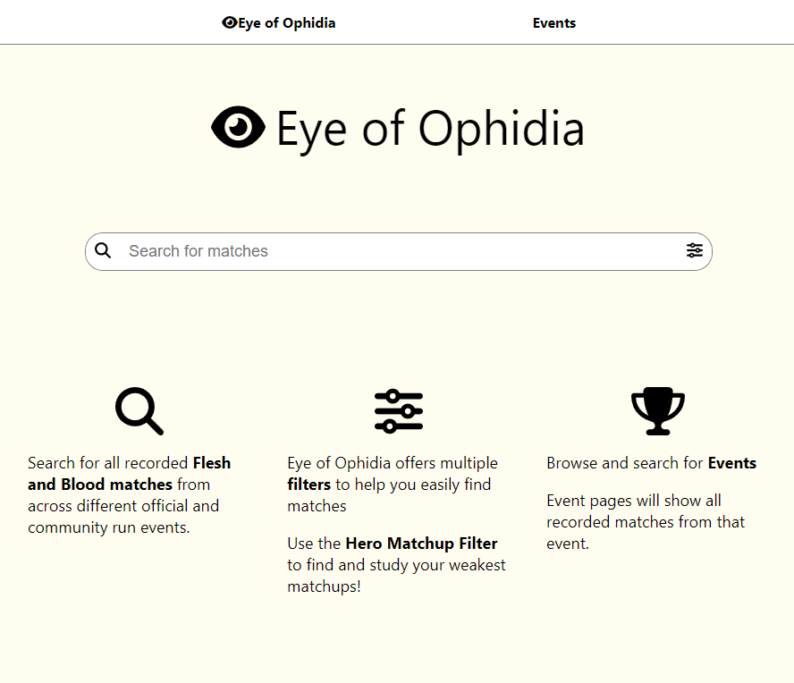
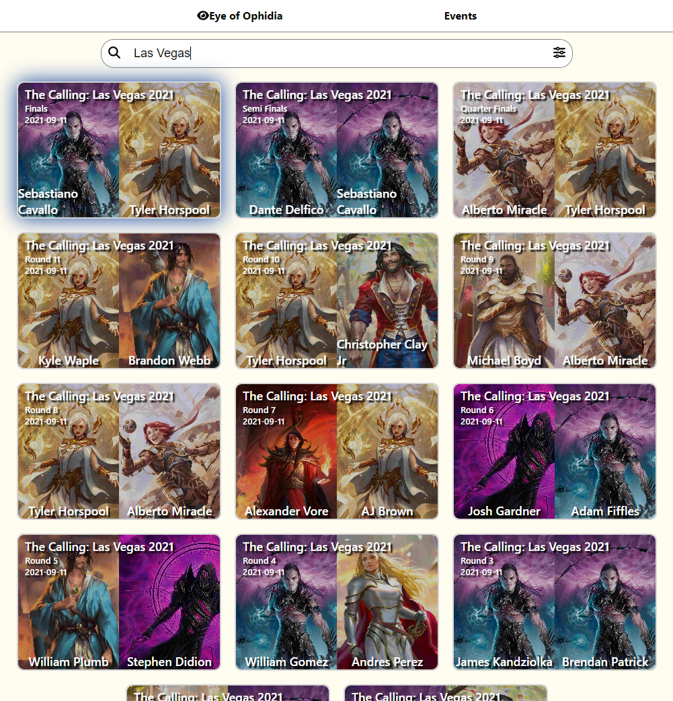
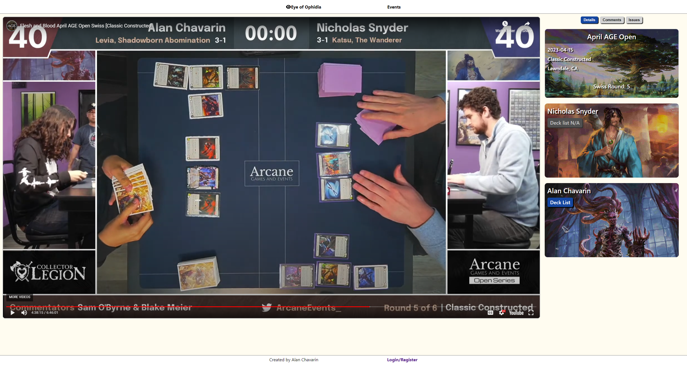
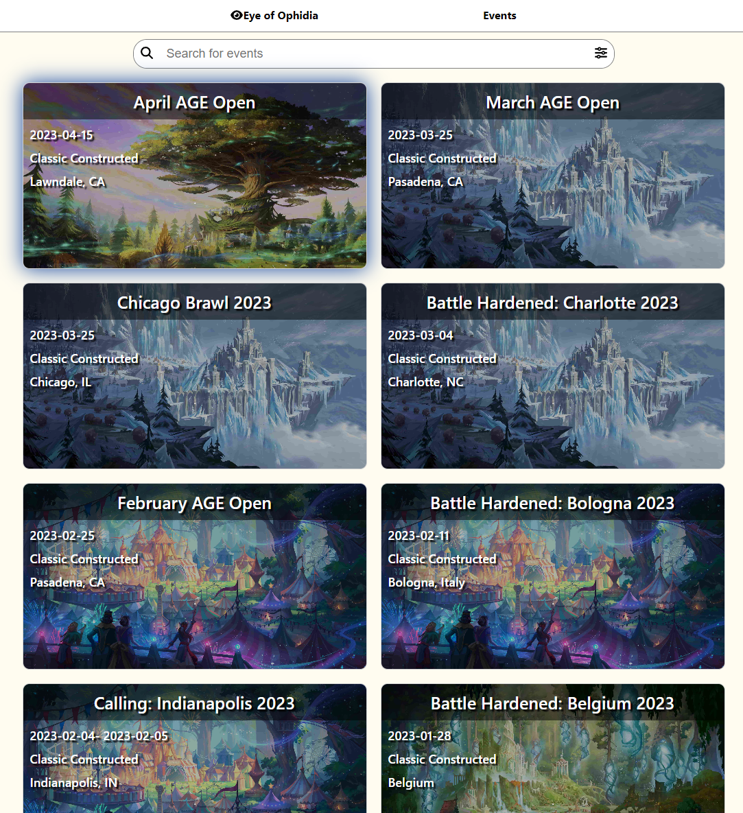
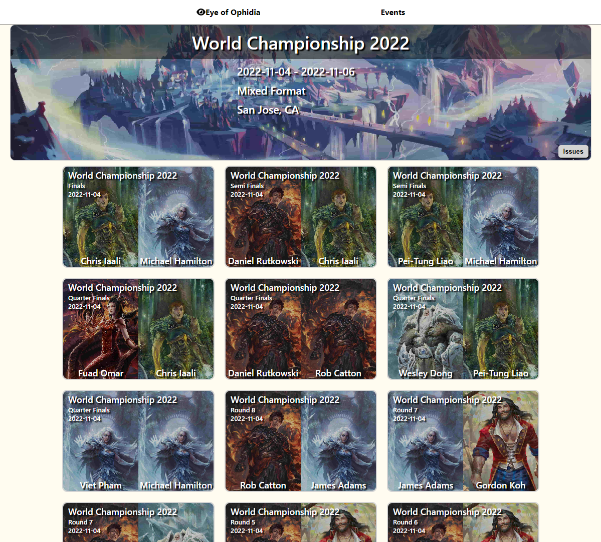
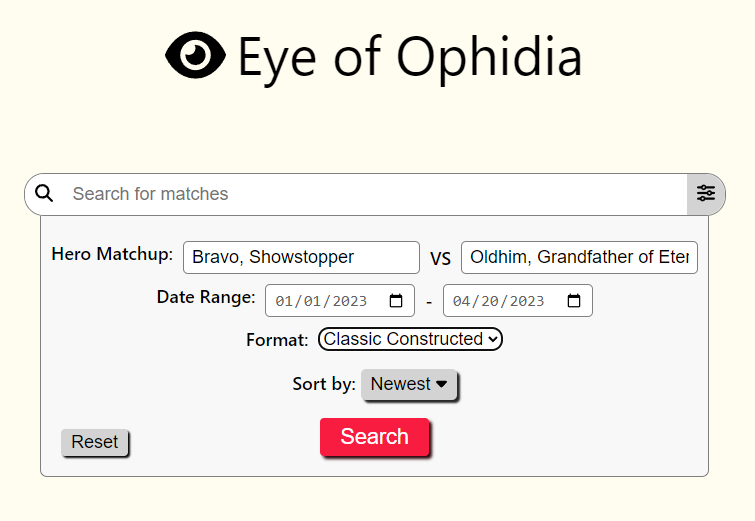

    <a href="https://www.eyeofophidia.net">
        <strong>Eye of Ophidia</strong>
    </a>
    is a tool that catalouges all streamed matches from official and community ran tournaments and events for the popular trading card game, Flesh and Blood TCG!
     
    Users can search matches via text search, or can use parameters such as hero matchup, date range and/or tournament format. Users may also head to the event page, where they can search for events and view all matches from a specific event. Match pages will link an embed to either to either a Twitch or Youtube VOD at the exact timestamp of when the match begins. 
     
    

<h2>
    Image Gallery
</h2>

    Home page for <a href="https://www.eyeofophidia.net">https://www.eyeofophidia.net</a>

    Match search results 

    Match Page

    Events search results

    Event Page

    Search Parameters Example

